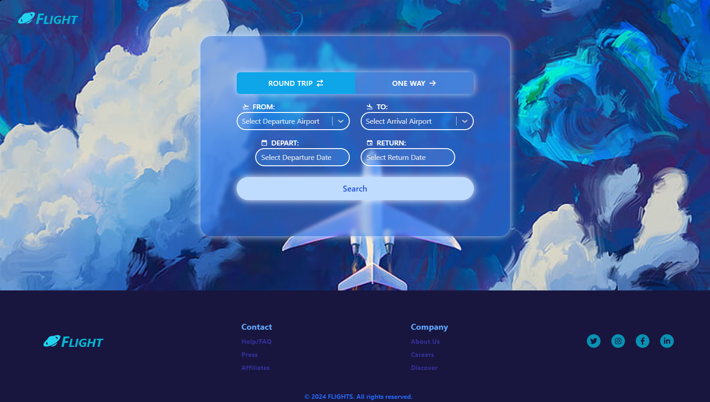
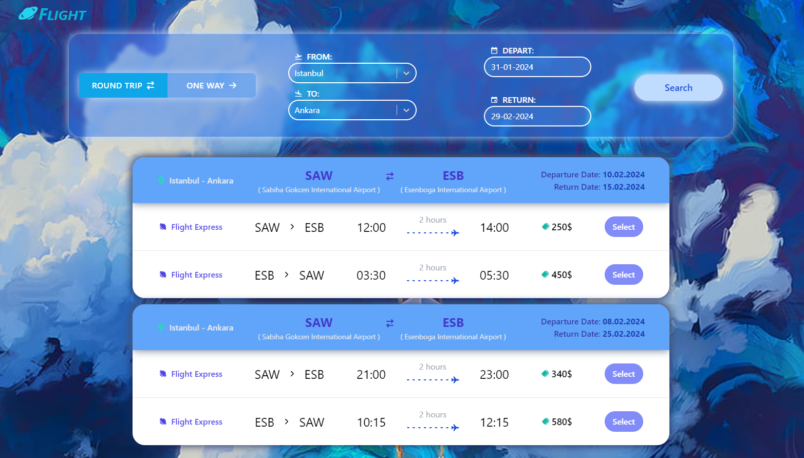
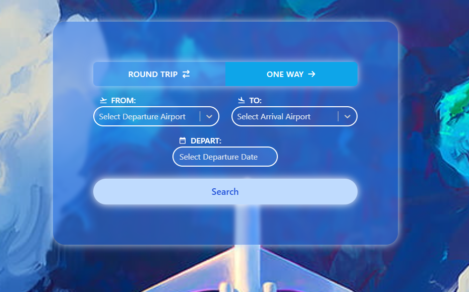
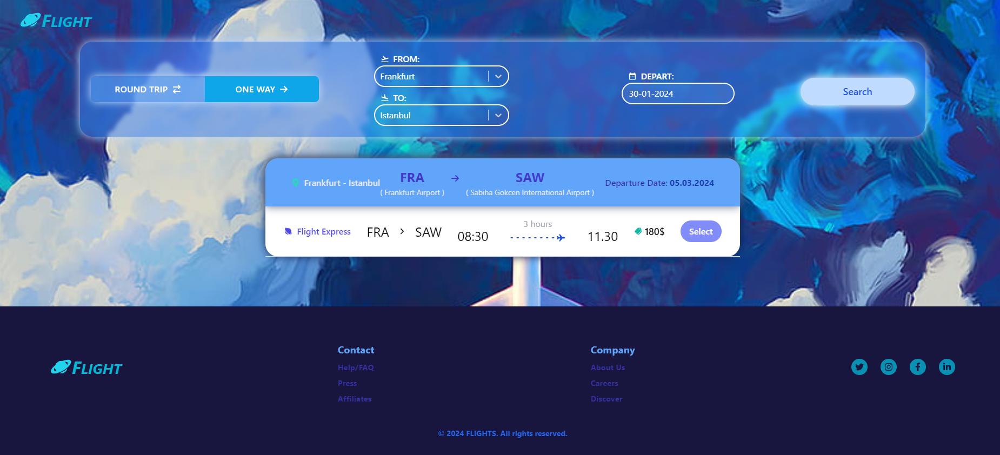

# Flight Search App - AMADEUS TASK PROJECT

This project is a flight ticket search application. If there is a one-way or round-trip flight to the specified destinations on the specified dates, it lists the appropriate flights. 

## Project Note
- React was used as the framework in the project. Tailwind CSS was used for styling, but in some cases inline css was also used. React-datepicker was used in the departure and return date input boxes and react-select was used for destination selection. A mock data was created for all API requests. Frontend works through requests made to this. All fields have been validated. All error situations from the server have been handled. At the same time, the situation of receiving empty data from the server was handled.

# Live Preview

You can access the live preview of the project [here.] [https://flight-search-app-five.vercel.app]

## Description of Project Pages

- **Homepage**
    - This is where the search and footer pages are displayed.

- **Search**
    - A search field has been created where departure airport, arrival airport, departure date and return date can be selected. An option was placed stating that it was a “one-way flight”. If this was selected, the return date was not entered. As soon as the departure and arrival airports are entered in the input boxes, airports can be searched by code and city. All error situations from the server have been handled.

- **Flight list**
    - The results returned after searching are listed here. Flights listed are sorted by departure time, return time, flight length and price.

- **Loading Spinner** 
    - A “loading” animation was shown to the user until a response was received from the server. React-spinners were used for this.

- **Loading Pop-Up**
    - The loading spinner is shown here as a pop-up on the page.

- **Footer**
    - This section is the footer of the site. There are features here such as social media icons and a form submission structure.

## Packages Used and Versions

- **react**: "^18.2.0",
- **react-icons**: "^^5.0.1",
- **react-scripts**: ^5.0.1
- **react-datepicker**: "^6.0.0",
- **tailwindcss**: "^3.4.1"
- **react-router-dom**: "^6.20.1",
- **react-dom**: "^18.2.0",
- **react-router-dom**: "^6.22.0",
- **react-select**: "^5.8.0",
- **react-spinners**: "^0.13.8",

## Getting Started

1. Git clone: `git clone https://github.com/gokcetasci/flight-search-app.git`
2. Go to the project directory: `cd projectname`
3. Install dependencies: `npm install`
4. Once the project dependencies are installed, you can start the project using the `npm start` command.

# Images

------------------------------------------------------------------------

------------------------------------------------------------------------

------------------------------------------------------------------------

